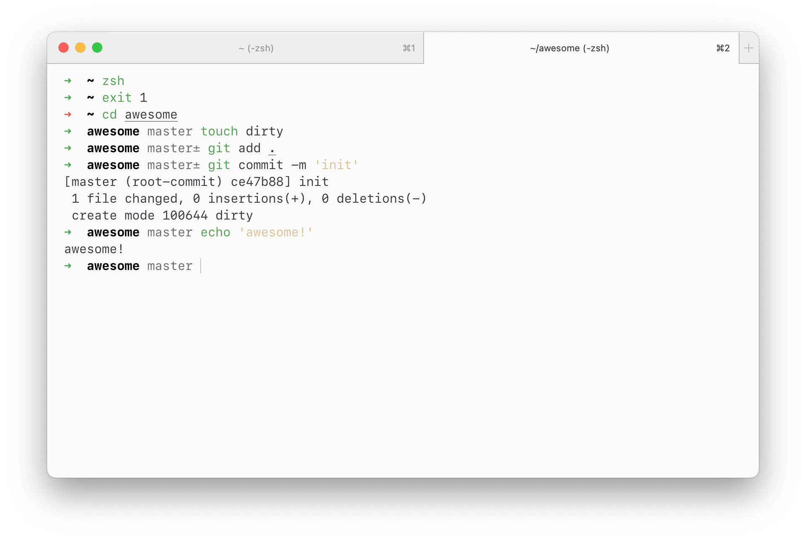

# min

> Minimalistic zsh prompt



## Install

### npm

```sh
npm install -g min-prompt
```

and add `min` to plugin list in your `.zshrc`:

```zsh
plugins=(min)
```

### Manually

Clone this repo and append next line to your `.zshrc`:

```zsh
source min/min.zsh
```

## Tip

In screenshot min is running with [one light](https://github.com/andrepolischuk/hyper-one-light) theme and Menlo font.

## License

MIT
